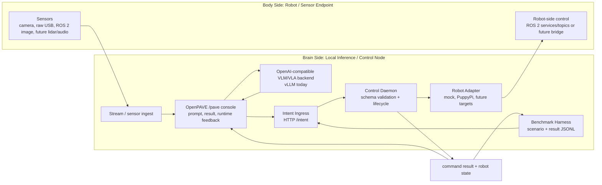

# OpenPAVE: Open Physical-AI VLA Experimentation

## A local-first validation workflow for edge Physical AI and brain-body co-computing

OpenPAVE helps developers rapidly validate how a local inference/control node connects to robot or sensor endpoints, how the runtime can be observed, how scenarios can be benchmarked, and how hardware targets can be replaced.

The project is not an LLM serving framework like vLLM or Ollama. It is a reference validation workflow for edge Physical AI experiments that combine:

- local VLM/VLA inference
- robot or sensor endpoints
- normalized intent
- runtime control
- robot adapters
- command and state feedback
- observability UI
- benchmark scenarios

## Demo

Recorded runs of the OpenPAVE brain-body workflow, by project version:

- **v0.9 — Real-time VLA on DGX Spark: RPi quadruped with LLaVA-7B** — [watch](https://youtu.be/kRiXri0te0g?si=iOhW0d2SSSP6zT4V)
  Early end-to-end proof of concept: an LLaVA-7B vision-language model on a DGX Spark drives
  an RPi-based quadruped (PuppyPi) in real time — the brain-side inference → body-side motion
  loop that OpenPAVE later formalized into normalized intent, robot adapters, and feedback.

- **v1.3 — Stage 3 runtime** — [watch](https://youtube.com/shorts/QwUnFLIUNe4?si=P6FuZvVzHTzYnd57)
  A short from the v1.3 (Stage 3) iteration — the runtime that hardened into Validated
  Baseline v1.0: the intent ingress → control daemon → PuppyPi adapter control path with the
  `/pave` console and command/state feedback.

## Validated Baseline v1.0

The current repository is organized around:

```text
OpenPAVE Validated Baseline v1.0
```

This baseline proves a reproducible local brain-body workflow before optimizing transport, control latency, and hardware coverage.

The first validated target is:

```text
PuppyPi + DGX
```

PuppyPi + DGX is a validated target, not the project boundary. Planned future targets include SO-101 robot arm + camera + DGX, Raspberry Pi ROS 2 car/camera + DGX or Thor, and additional robot/sensor endpoints with different ROS 2 communication patterns.

OpenPAVE targets the Armv9 brain-side platform family (DGX today; Thor and other Armv9 edge nodes planned), not a single vendor or SKU.

## Architecture



Current implementation:

- Brain side: DGX (Armv9 Grace CPU + Nvidia GPU) running vLLM, OpenPAVE runtime services, and the `/pave` console.
- Body side: PuppyPi running ROS 2 `puppy_control`.
- Control path: Intent Ingress -> Control Daemon -> Robot Adapter -> Dockerized ROS 2 CLI.
- Feedback path: command result and robot state JSON files consumed by the UI and benchmark harness.

## Quick Start

Use the validated baseline guide as the primary runbook:

```text
docs/validated-baseline.md
```

Minimal software-only validation:

```bash
cd /path/to/OpenPAVE

git submodule update --init --recursive

python3 -m venv .venv
source .venv/bin/activate

python3 -m pip install -U pip
python3 -m pip install -r intent_ingress/requirements.txt
python3 -m pip install -e ui

OPENPAVE_CONFIG=configs/mock.env ./scripts/run_stage3_demo.sh
```

Open:

```text
http://127.0.0.1:8090/pave
```

## Runtime Profiles

OpenPAVE uses repo-level environment profiles:

```text
configs/mock.env
configs/puppypi.env
```

`mock.env` validates the runtime without robot hardware.

`puppypi.env` routes commands through the PuppyPi adapter and expects the robot-side ROS 2 controller and local VLM backend to be running.

## Benchmarking

Start the runtime, then run:

```bash
python3 scripts/run_benchmark.py scenarios/mock-intent-stop-trot.json
python3 scripts/summarize_benchmarks.py benchmark-results/*.jsonl
```

The current benchmark harness validates the control path. Future work will add sensor replay, VLM/VLA output quality checks, transport latency, and multi-target comparison.

## Current Limitations

- The current PuppyPi command path uses Dockerized one-shot ROS 2 CLI calls. This is simple and reproducible, but not the final low-latency robot control plane.
- ROS 2 over Wi-Fi and DDS/RMW behavior can vary by machine, network, container image, and firewall settings. The validated default path is `rmw_fastrtps_cpp`; `rmw_cyclonedds_cpp` is documented as an environment-specific workaround.
- The `/pave` console currently lives in the OpenPAVE-maintained `live-vlm-webui` fork. A native OpenPAVE console is planned.
- Camera/sensor replay and full end-to-end VLM/VLA quality benchmarking are future work.

## Documentation

Start here:

- [Documentation Index](docs/index.md)
- [Validated Baseline Guide](docs/validated-baseline.md)
- [PuppyPi + DGX Target](docs/targets/puppypi-dgx.md)
- [Further Work](docs/further-work.md)

Core specs:

- [Architecture](docs/architecture.md)
- [Intent Schema](docs/intent-schema.md)
- [Robot Adapters](docs/robot-adapters.md)
- [Robot Feedback](docs/robot-feedback.md)
- [Benchmark Harness](docs/benchmark-harness.md)
- [Prompts and Scenarios](docs/prompts-and-scenarios.md)
- [OpenPAVE Console](docs/pave-console.md)
- [Third-Party Notices](docs/third-party-notices.md)

Historical material is kept under:

```text
docs/archive/
```

## Third-Party Notice

OpenPAVE currently uses an OpenPAVE-maintained fork of `NVIDIA-AI-IOT/live-vlm-webui` as a submodule for the UI/backend path. This does not imply NVIDIA endorsement or official product alignment. See [Third-Party Notices](docs/third-party-notices.md).
