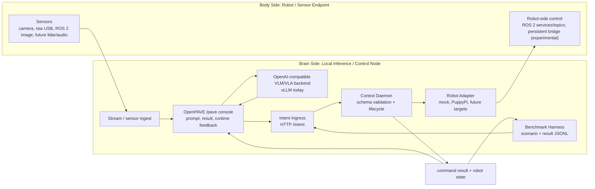

# OpenPAVE: Open Physical AI Validation and Experimentation

## An open reference workflow for Physical AI demos on Arm-based edge platforms

OpenPAVE connects pieces that are often evaluated separately into one verifiable Physical AI workflow:

- local VLM/VLA inference
- robot or sensor endpoints
- robot middleware
- normalized intent and control contracts
- command and state feedback
- observability UI
- demo runbooks
- benchmark and validation paths

The project is not an LLM serving framework like vLLM or Ollama. OpenPAVE is an early reference validation and experimentation workflow that helps developers catalogue, run, observe, compare, and optionally integrate Physical AI demos at different depths.

## What OpenPAVE Provides

OpenPAVE supports several levels of demo integration:

```text
Level 0: Catalogue only
Level 1: Launch / status / result wrapper
Level 2: State or result bridge
Level 3: Normalized intent / control contract
Level 4: Benchmark integration
```

A demo can remain independently runnable while OpenPAVE provides a common place to describe it, link validation notes, launch or observe it, collect high-level results, or connect it through deeper runtime and benchmark contracts.

## Demo

Recorded runs of the OpenPAVE brain-body workflow, by project version:

- **v0.9 — Real-time VLA on DGX Spark: RPi quadruped with LLaVA-7B** — [watch](https://youtu.be/kRiXri0te0g?si=iOhW0d2SSSP6zT4V)
  Early end-to-end proof of concept: an LLaVA-7B vision-language model on a DGX Spark drives
  an RPi-based quadruped (PuppyPi) in real time. This brain-side inference to body-side motion
  loop later became the first OpenPAVE deep-integration reference path.

- **v1.3 — Stage 3 runtime** — [watch](https://youtube.com/shorts/QwUnFLIUNe4?si=P6FuZvVzHTzYnd57)
  A short from the v1.3 iteration that hardened into Validated Baseline v1.0: intent ingress,
  control daemon, PuppyPi adapter, `/pave` console, and command/state feedback.

## Validated Baseline v1.0

The first validated target is:

```text
PuppyPi + DGX
```

PuppyPi + DGX is the first validated deep-integration example, not the project boundary. It demonstrates the full brain/control reference path:

```text
local VLM/VLA inference
-> normalized intent
-> Control Daemon
-> Robot Adapter
-> ROS 2 execution
-> command/state feedback
-> benchmark validation
```

Other demos do not need to adopt this full path. They can join OpenPAVE at lighter integration levels, such as catalogue-only entries, launch/status wrappers, or result summaries.

Planned future targets include SO-101 robot arm + camera, Raspberry Pi ROS 2 car/camera, and additional robot/sensor endpoints with different middleware and communication patterns.

OpenPAVE targets the Armv9 brain-side platform family (DGX today; Thor and other Armv9 edge nodes planned), not a single vendor or SKU.

## Architecture



Current validated implementation:

- Brain side: DGX (Armv9 Grace CPU + Nvidia GPU) running vLLM, OpenPAVE runtime services, and the `/pave` console.
- Body side: PuppyPi running ROS 2 `puppy_control`.
- Control path: Intent Ingress -> Control Daemon -> Robot Adapter -> Dockerized ROS 2 CLI.
- Feedback path: command result and robot state JSON files consumed by the UI and benchmark harness.

## Quick Start

Use the validated baseline guide as the primary runbook:

```text
docs/validated-baseline.md
```

Minimal software-only validation:

```bash
cd /path/to/OpenPAVE

git submodule update --init --recursive

python3 -m venv .venv
source .venv/bin/activate

python3 -m pip install -U pip
python3 -m pip install -r intent_ingress/requirements.txt
python3 -m pip install -e ui

OPENPAVE_CONFIG=configs/mock.env ./scripts/run_stage3_demo.sh
```

Open:

```text
http://127.0.0.1:8090/pave
```

## Demo Integration

Start with:

- [Demo Integration Levels](docs/demo-integration-levels.md)
- [Demo Catalogue](docs/demo-catalog.md)
- [Contributing Demos](docs/contributing-demos.md)

These documents describe how Physical AI demos can join OpenPAVE at different levels, from a catalogue entry to launch/status hooks, state/result bridges, normalized intent control, or benchmark integration.

## Benchmarking

Start the runtime, then run:

```bash
python3 scripts/run_benchmark.py scenarios/mock-intent-stop-trot.json
python3 scripts/summarize_benchmarks.py benchmark-results/*.jsonl
```

The current benchmark harness validates the control path. Future work will add sensor replay, VLM/VLA output quality checks, transport latency, and multi-target comparison.

## Current Limitations

- The **default** PuppyPi command path uses Dockerized one-shot ROS 2 CLI calls — simple and reproducible. An experimental low-latency control plane now exists (`ROBOT_ADAPTER=puppypi_bridge`, a persistent body-side bridge with automatic fallback to the CLI path; real PuppyPi STOP p95 −89%), but it is not yet the default. See `experiments/persistent-bridge/`.
- ROS 2 over Wi-Fi and DDS/RMW behavior can vary by machine, network, container image, and firewall settings. The validated default path is `rmw_fastrtps_cpp`; `rmw_cyclonedds_cpp` is documented as an environment-specific workaround.
- The `/pave` console currently lives in the OpenPAVE-maintained `live-vlm-webui` fork. A native OpenPAVE console is planned.
- Camera/sensor replay and full end-to-end VLM/VLA quality benchmarking are future work.

## Documentation

Start here:

- [Documentation Index](docs/index.md)
- [Validated Baseline Guide](docs/validated-baseline.md)
- [Demo Integration Levels](docs/demo-integration-levels.md)
- [Demo Catalogue](docs/demo-catalog.md)
- [Further Work](docs/further-work.md)

Core specs:

- [Architecture](docs/architecture.md)
- [Brain-Body Architecture](docs/architecture-brain-body.md)
- [Intent Schema](docs/intent-schema.md)
- [Robot Adapters](docs/robot-adapters.md)
- [Robot Feedback](docs/robot-feedback.md)
- [Benchmark Harness](docs/benchmark-harness.md)
- [Ecosystem Validation Map](docs/ecosystem-validation-map.md)
- [Third-Party Notices](docs/third-party-notices.md)

Historical material is kept under:

```text
docs/archive/
```

## Third-Party Notice

OpenPAVE currently uses an OpenPAVE-maintained fork of `NVIDIA-AI-IOT/live-vlm-webui` as a submodule for the UI/backend path. This does not imply NVIDIA endorsement or official product alignment. See [Third-Party Notices](docs/third-party-notices.md).
