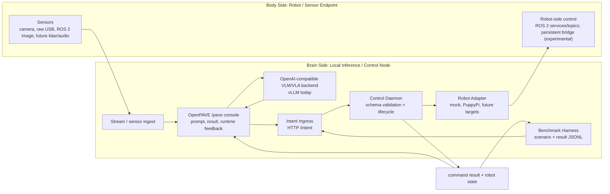

# OpenPAVE: Open Physical AI Validation and Experimentation

## 面向 Arm-based edge platforms 的 Physical AI demo 開放驗證與實驗 workflow

OpenPAVE 將原本常常分散評估的元件，接成一條可以驗證的 Physical AI workflow：

- local VLM/VLA inference
- robot 或 sensor endpoints
- robot middleware
- normalized intent 與 control contracts
- command and state feedback
- observability UI
- demo runbooks
- benchmark and validation paths

這個專案不是像 vLLM 或 Ollama 這類 LLM serving framework。OpenPAVE 是早期 reference validation and experimentation workflow，目標是幫助開發者 catalogue、run、observe、compare，並依照不同深度選擇性整合 Physical AI demos。

## OpenPAVE 提供什麼

OpenPAVE 支援不同深度的 demo integration：

```text
Level 0: Catalogue only
Level 1: Launch / status / result wrapper
Level 2: State or result bridge
Level 3: Normalized intent / control contract
Level 4: Benchmark integration
```

Demo 可以維持獨立執行，同時透過 OpenPAVE 提供共同描述、validation notes、launch/status hooks、high-level results，或進一步接上 runtime 與 benchmark contracts。

## Demo

依照專案版本整理的 OpenPAVE brain-body workflow 錄影：

- **v0.9 — Real-time VLA on DGX Spark: RPi quadruped with LLaVA-7B** — [watch](https://youtu.be/kRiXri0te0g?si=iOhW0d2SSSP6zT4V)
  早期 end-to-end proof of concept：在 DGX Spark 上執行 LLaVA-7B vision-language model，即時驅動 RPi-based quadruped（PuppyPi）。這條 brain-side inference 到 body-side motion loop，後續成為 OpenPAVE 第一個 deep-integration reference path。

- **v1.3 — Stage 3 runtime** — [watch](https://youtube.com/shorts/QwUnFLIUNe4?si=P6FuZvVzHTzYnd57)
  v1.3 iteration 的短片。這個 runtime 後續硬化成 Validated Baseline v1.0：intent ingress、control daemon、PuppyPi adapter、`/pave` console 與 command/state feedback。

## Validated Baseline v1.0

第一個 validated target 是：

```text
PuppyPi + DGX
```

PuppyPi + DGX 是第一個 validated deep-integration example，不是專案邊界。它展示完整 brain/control reference path：

```text
local VLM/VLA inference
-> normalized intent
-> Control Daemon
-> Robot Adapter
-> ROS 2 execution
-> command/state feedback
-> benchmark validation
```

其他 demo 不需要採用這條完整路徑。它們可以用較輕量的 integration level 加入，例如 catalogue-only、launch/status wrappers，或 result summaries。

未來規劃 targets 包含 SO-101 robot arm + camera、Raspberry Pi ROS 2 car/camera，以及使用不同 middleware 與 communication pattern 的其他 robot/sensor endpoints。

OpenPAVE 的 brain-side platform 目標是 Armv9 平台家族（目前是 DGX；未來規劃 Thor 與其他 Armv9 edge nodes），而不是單一 vendor 或 SKU。

## Architecture



目前 validated implementation：

- Brain side：DGX（Armv9 Grace CPU + Nvidia GPU）執行 vLLM、OpenPAVE runtime services 與 `/pave` console。
- Body side：PuppyPi 執行 ROS 2 `puppy_control`。
- Control path：Intent Ingress -> Control Daemon -> Robot Adapter -> Dockerized ROS 2 CLI。
- Feedback path：command result 與 robot state JSON files，供 UI 與 benchmark harness 使用。

## Quick Start

主要操作 runbook 請使用 validated baseline guide：

```text
docs/validated-baseline.md
```

最小 software-only 驗證：

```bash
cd /path/to/OpenPAVE

git submodule update --init --recursive

python3 -m venv .venv
source .venv/bin/activate

python3 -m pip install -U pip
python3 -m pip install -r intent_ingress/requirements.txt
python3 -m pip install -e ui

OPENPAVE_CONFIG=configs/mock.env ./scripts/run_stage3_demo.sh
```

開啟：

```text
http://127.0.0.1:8090/pave
```

## Demo Integration

建議從這裡開始：

- [Demo Integration Levels](docs/demo-integration-levels.md)
- [Demo Catalogue](docs/demo-catalog.md)
- [Contributing Demos](docs/contributing-demos.md)

這些文件說明 Physical AI demos 如何用不同深度加入 OpenPAVE，從 catalogue entry 到 launch/status hooks、state/result bridges、normalized intent control，或 benchmark integration。

## Benchmarking

先啟動 runtime，然後執行：

```bash
python3 scripts/run_benchmark.py scenarios/mock-intent-stop-trot.json
python3 scripts/summarize_benchmarks.py benchmark-results/*.jsonl
```

目前 benchmark harness 驗證的是 control path。未來工作會加入 sensor replay、VLM/VLA output quality checks、transport latency 與 multi-target comparison。

## Current Limitations

- 目前 **default** 的 PuppyPi command path 使用 Dockerized one-shot ROS 2 CLI calls，簡單且可重現。現在已有一條 experimental 的 low-latency control plane（`ROBOT_ADAPTER=puppypi_bridge`，常駐 body-side bridge，並自動 fallback 回 CLI path；真機 PuppyPi STOP p95 −89%），但尚未成為 default。見 `experiments/persistent-bridge/`。
- 目前 **default** 的 brain↔body seam 是 ROS-native（`rmw_zenoh`）。現在已有一條 experimental 的**中性、非 ROS seam**（raw zenoh + capability JSON）：一個完全不含 ROS 的純 Python body 也能成為一等公民。已在**單機**、**跨主機**（兩台機器、兩個 Python 版本）、以及**端到端打通真機 controller** 三個層級驗證。屬 experimental，尚未成為 default。見 `experiments/neutral-seam/`。
- ROS 2 over Wi-Fi 與 DDS/RMW 行為可能因 machine、network、container image 與 firewall settings 而不同。目前 validated default path 是 `rmw_fastrtps_cpp`；`rmw_cyclonedds_cpp` 已記錄為 environment-specific workaround。
- `/pave` console 目前仍位於 OpenPAVE-maintained `live-vlm-webui` fork。未來規劃 OpenPAVE-native console。
- Camera/sensor replay 與完整 end-to-end VLM/VLA quality benchmarking 是 future work。

## Documentation

建議從這裡開始：

- [Documentation Index](docs/index.md)
- [Validated Baseline Guide](docs/validated-baseline.md)
- [Demo Integration Levels](docs/demo-integration-levels.md)
- [Demo Catalogue](docs/demo-catalog.md)
- [Further Work](docs/further-work.md)

核心規格：

- [Architecture](docs/architecture.md)
- [Brain-Body Architecture](docs/architecture-brain-body.md)
- [Intent Schema](docs/intent-schema.md)
- [Robot Adapters](docs/robot-adapters.md)
- [Robot Feedback](docs/robot-feedback.md)
- [Benchmark Harness](docs/benchmark-harness.md)
- [Ecosystem Validation Map](docs/ecosystem-validation-map.md)
- [Third-Party Notices](docs/third-party-notices.md)

歷史資料保留於：

```text
docs/archive/
```

## Third-Party Notice

OpenPAVE 目前使用 OpenPAVE-maintained fork of `NVIDIA-AI-IOT/live-vlm-webui` 作為 UI/backend path 的 submodule。這不代表 NVIDIA endorsement 或官方 product alignment。請參考 [Third-Party Notices](docs/third-party-notices.md)。
