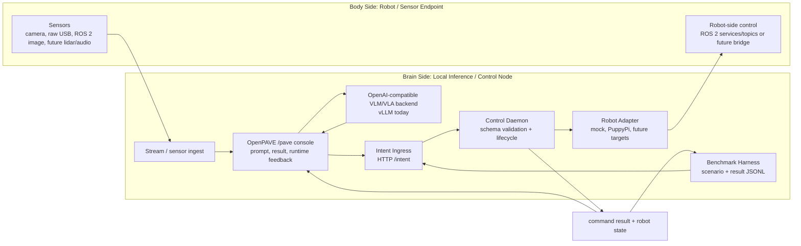

# OpenPAVE: Open Physical-AI VLA Experimentation

## 面向 edge Physical AI 與大小腦協同運算的 local-first 驗證 workflow

OpenPAVE 幫助開發者快速驗證 local inference/control node 如何連接 robot 或 sensor endpoint、runtime 行為如何被觀察、scenario 如何被 benchmark，以及 hardware target 如何被替換。

這個專案不是像 vLLM 或 Ollama 這類 LLM serving framework。OpenPAVE 是一個 edge Physical AI experiment 的 reference validation workflow，用來組合：

- local VLM/VLA inference
- robot 或 sensor endpoints
- normalized intent
- runtime control
- robot adapters
- command and state feedback
- observability UI
- benchmark scenarios

## Demo

依照專案版本整理的 OpenPAVE brain-body workflow 錄影：

- **v0.9 — Real-time VLA on DGX Spark: RPi quadruped with LLaVA-7B** — [watch](https://youtu.be/kRiXri0te0g?si=iOhW0d2SSSP6zT4V)
  早期 end-to-end proof of concept：在 DGX Spark 上執行 LLaVA-7B vision-language model，即時驅動 RPi-based quadruped（PuppyPi）。這條 brain-side inference -> body-side motion loop，後續被 OpenPAVE 正式整理成 normalized intent、robot adapters 與 feedback。

- **v1.3 — Stage 3 runtime** — [watch](https://youtube.com/shorts/QwUnFLIUNe4?si=P6FuZvVzHTzYnd57)
  v1.3（Stage 3）iteration 的短片。這個 runtime 後續硬化成 Validated Baseline v1.0：intent ingress -> control daemon -> PuppyPi adapter control path，並包含 `/pave` console 與 command/state feedback。

## Validated Baseline v1.0

目前 repo 以以下 baseline 為核心整理：

```text
OpenPAVE Validated Baseline v1.0
```

這個 baseline 的目的，是先證明一條可重現的 local brain-body workflow，再進一步優化 transport、control latency 與 hardware coverage。

第一個 validated target 是：

```text
PuppyPi + DGX
```

PuppyPi + DGX 是 validated target，不是專案邊界。未來規劃的 targets 包含 SO-101 robot arm + camera + DGX、Raspberry Pi ROS 2 car/camera + DGX 或 Thor，以及使用不同 ROS 2 communication pattern 的其他 robot/sensor endpoints。

OpenPAVE 的 brain-side platform 目標是 Armv9 平台家族（目前是 DGX；未來規劃 Thor 與其他 Armv9 edge nodes），而不是單一 vendor 或 SKU。

## Architecture



目前實作：

- Brain side：DGX（Armv9 Grace CPU + Nvidia GPU）執行 vLLM、OpenPAVE runtime services 與 `/pave` console。
- Body side：PuppyPi 執行 ROS 2 `puppy_control`。
- Control path：Intent Ingress -> Control Daemon -> Robot Adapter -> Dockerized ROS 2 CLI。
- Feedback path：command result 與 robot state JSON files，供 UI 與 benchmark harness 使用。

## Quick Start

主要操作 runbook 請使用 validated baseline guide：

```text
docs/validated-baseline.md
```

最小 software-only 驗證：

```bash
cd /path/to/OpenPAVE

git submodule update --init --recursive

python3 -m venv .venv
source .venv/bin/activate

python3 -m pip install -U pip
python3 -m pip install -r intent_ingress/requirements.txt
python3 -m pip install -e ui

OPENPAVE_CONFIG=configs/mock.env ./scripts/run_stage3_demo.sh
```

開啟：

```text
http://127.0.0.1:8090/pave
```

## Runtime Profiles

OpenPAVE 使用 repo-level environment profiles：

```text
configs/mock.env
configs/puppypi.env
```

`mock.env` 用於不連接 robot hardware 的 runtime 驗證。

`puppypi.env` 會透過 PuppyPi adapter 路由 commands，並預期 robot-side ROS 2 controller 與 local VLM backend 已經啟動。

## Benchmarking

先啟動 runtime，然後執行：

```bash
python3 scripts/run_benchmark.py scenarios/mock-intent-stop-trot.json
python3 scripts/summarize_benchmarks.py benchmark-results/*.jsonl
```

目前 benchmark harness 驗證的是 control path。未來工作會加入 sensor replay、VLM/VLA output quality checks、transport latency 與 multi-target comparison。

## Current Limitations

- 目前 PuppyPi command path 使用 Dockerized one-shot ROS 2 CLI calls。這個方式簡單且可重現，但不是最終的 low-latency robot control plane。
- ROS 2 over Wi-Fi 與 DDS/RMW 行為可能因 machine、network、container image 與 firewall settings 而不同。目前 validated default path 是 `rmw_fastrtps_cpp`；`rmw_cyclonedds_cpp` 已記錄為 environment-specific workaround。
- `/pave` console 目前仍位於 OpenPAVE-maintained `live-vlm-webui` fork。未來規劃 OpenPAVE-native console。
- Camera/sensor replay 與完整 end-to-end VLM/VLA quality benchmarking 是 future work。

## Documentation

建議從這裡開始：

- [Documentation Index](docs/index.md)
- [Validated Baseline Guide](docs/validated-baseline.md)
- [PuppyPi + DGX Target](docs/targets/puppypi-dgx.md)
- [Further Work](docs/further-work.md)

核心規格：

- [Architecture](docs/architecture.md)
- [Brain-Body Architecture](docs/architecture-brain-body.md)
- [Intent Schema](docs/intent-schema.md)
- [Robot Adapters](docs/robot-adapters.md)
- [Robot Feedback](docs/robot-feedback.md)
- [Benchmark Harness](docs/benchmark-harness.md)
- [Prompts and Scenarios](docs/prompts-and-scenarios.md)
- [OpenPAVE Console](docs/pave-console.md)
- [Third-Party Notices](docs/third-party-notices.md)

歷史資料保留於：

```text
docs/archive/
```

## Third-Party Notice

OpenPAVE 目前使用 OpenPAVE-maintained fork of `NVIDIA-AI-IOT/live-vlm-webui` 作為 UI/backend path 的 submodule。這不代表 NVIDIA endorsement 或官方 product alignment。請參考 [Third-Party Notices](docs/third-party-notices.md)。
