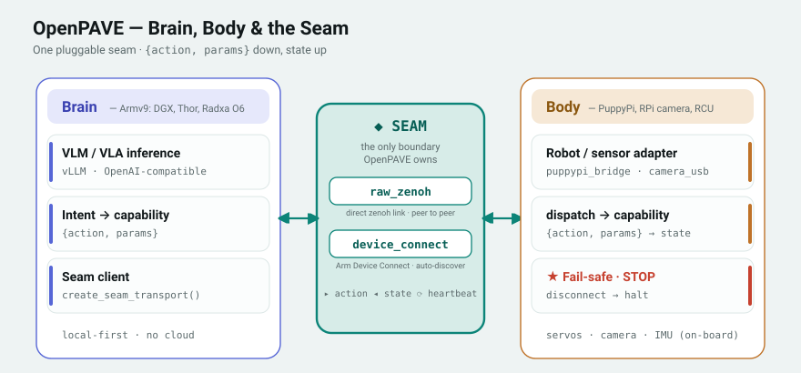

# Brain–Body Architecture

Brain issues high-level intent; the body runs the real-time loop and fails safe
on disconnect. The two are joined by **one pluggable seam** — a swappable
transport with no central router: `raw_zenoh` (a direct peer-to-peer zenoh link,
body listens / brain connects) or `device_connect` (Arm Device Connect, with D2D
auto-discovery over zenoh multicast).



- Downlink = `{action, params}` capability command · uplink = state · plus heartbeat
- Transports: `raw_zenoh` (direct zenoh, listen / connect) · `device_connect` (Arm Device Connect · D2D auto-discovery, no server)
- ★ = fail-safe: on disconnect or e-stop, the body halts

## Glossary

### Intent

An intent is a normalized high-level action request from the brain to the
body. It is not a low-level motor command.

For example, `STOP`, `TROT`, `MOVE`, or `GRASP` describe what the brain wants
the body to do. The body-side controller or adapter is responsible for turning
that intent into robot-specific ROS 2 services, topics, controller calls, or
future hardware-specific actions.

### Control Contract

The control contract is the agreed format and meaning of commands exchanged
between the brain and the body.

OpenPAVE uses normalized intent as this brain-to-body control contract. This
lets different brain-side sources, such as a VLM/VLA model, a planner, the
OpenPAVE console, or a benchmark harness, all send commands through the same
body-side interface.

### RPC

RPC means Remote Procedure Call. In this architecture, the brain calls a
function-like endpoint on the body over the network.

For example, the brain can call a body-side `submit_intent` operation with a
normalized intent payload. The body receives the request, executes or rejects
it, and returns a command result.

### Body-Emitted State

Body-emitted state is low-rate structured status that the body reports back to
the brain.

Examples include controller health, heartbeat, current robot status, command
result, battery state, pose, joint state, or fail-safe status. This state helps
the brain, UI, benchmark harness, or future agent layer understand what the
body is doing.

High-bandwidth sensor payloads, such as camera frames, depth images, audio, or
lidar streams, should be modeled as a separate sensor/data plane rather than
embedded directly in body-emitted state. The camera MVE implements this split:
small metadata on the control plane, the JPEG on a dedicated compressed topic.

### Brain-Side Model Input and Output

The VLM/VLA model or planner on the brain side consumes observations, task
prompts, and robot/body state. It produces a normalized intent, which is then
sent to the body through the control contract.

In short:

```text
sensor observation + user/task prompt + robot/body state
-> VLM/VLA or planner on the brain
-> normalized intent
-> body RPC
-> body-side controller or adapter
```

## Relationship to Demo Integration Levels

This brain/body control contract is the deep-integration path in OpenPAVE. It
applies when a demo chooses Level 3 or Level 4 integration.

Other demos can still be represented in OpenPAVE at lighter levels, such as a
catalogue entry, launch/status wrapper, or result bridge. Those demos can keep
their own runtime and control loop while using OpenPAVE for discovery,
observability, validation notes, or later benchmark integration.
