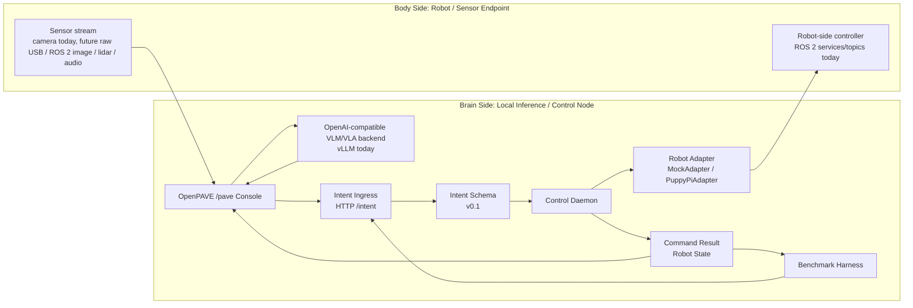

# OpenPAVE Architecture

## Purpose

OpenPAVE is a local-first validation workflow for edge Physical AI experiments and brain-body co-computing.

The architecture helps developers validate how a brain-side local inference/control node connects to body-side robot or sensor endpoints, how runtime behavior can be observed, how scenarios can be benchmarked, and how hardware targets can be replaced.

PuppyPi + DGX is the first validated target, not the project boundary.

## Current Architecture



## Replaceable Roles

### Body Side: Robot / Sensor Endpoint

This role provides physical-world observations and accepts control commands.

Responsibilities:

- expose camera, raw USB, ROS 2 image, depth, audio, lidar, robot state, or other sensor streams
- run robot-side controllers, ROS 2 services/topics, or future bridge processes
- receive commands from an OpenPAVE adapter or future transport-aware bridge
- execute physical or simulated robot actions

Current validation:

- PuppyPi
- PuppyPi camera stream
- `puppy_control` ROS 2 services and topics

Planned targets:

- SO-101 robot arm with camera + DGX
- Raspberry Pi ROS 2 car/camera + DGX or Thor
- additional robot/sensor endpoints with OpenPAVE adapters

### Brain Side: Local Inference / Control Node

This role runs inference, runtime control services, observability, and benchmarks.

Responsibilities:

- run VLM/VLA inference through an OpenAI-compatible API
- display live robot/sensor streams
- manage prompts and observe model outputs
- normalize high-level intent
- dispatch validated commands through adapters
- expose command result and robot state feedback
- run benchmark scenarios

Current validation:

- DGX
- vLLM
- `llava-hf/llava-v1.6-mistral-7b-hf`
- OpenPAVE `/pave` console through the `ui/` submodule

Future targets:

- Thor
- other Arm-based edge inference/control nodes
- local VLM serving stacks compatible with OpenAI-style APIs
- future GPU/NPU/VPU inference runtimes

### OpenPAVE Runtime Control Layer

The runtime control layer turns high-level model or user intent into validated robot commands.

Current components:

- Intent Ingress API
- normalized intent schema
- Control Daemon
- `MockAdapter`
- `PuppyPiAdapter`
- command result feedback
- robot state feedback
- benchmark harness

## Current Baseline Path

Validated Baseline v1.0 uses a simple, inspectable command path:

```text
OpenPAVE /pave or benchmark
-> Intent Ingress
-> normalized intent
-> Control Daemon
-> Robot Adapter
-> Dockerized ROS 2 CLI
-> robot-side ROS 2 controller
```

This path favors reproducibility and debuggability over low-latency robot control.

## Current Limitations

### Brain-Body Transport

The current PuppyPi target uses ROS 2 communication over the available network path. This is the baseline communication path, not the final optimized brain-body transport layer.

Future work will add an upgraded open-source transport option and benchmark it against the current ROS 2 over Wi-Fi path.

### Robot Command Execution

The current `PuppyPiAdapter` uses one-shot Dockerized ROS 2 CLI calls. This is useful for validation and debugging, but inefficient for repeated, compound, or low-latency robot control.

Future work will add a persistent robot bridge or transport-aware adapter while preserving the Docker CLI path as a fallback.

## Interfaces

### Intent Ingress API

`POST /intent`:

```json
{ "text": "STOP" }
```

or:

```json
{
  "intent": "MOVE",
  "params": {
    "vx": 0.0,
    "yaw": 0.6,
    "duration_ms": 600
  },
  "source": "manual"
}
```

### Runtime Feedback

Default runtime feedback files:

```text
.openpave/runtime/vla_command_result.json
.openpave/runtime/vla_robot_state.json
```

Legacy or manually configured runs may still use:

```text
/tmp/vla_command_result.json
/tmp/vla_robot_state.json
```

### Inference Backend

The first inference backend contract is an OpenAI-compatible VLM API.

Current default:

```text
http://localhost:8000/v1
```

## Design Notes

- PuppyPi + DGX is the first validated target, not the final hardware boundary.
- Robot adapters are the current contribution surface for new hardware.
- Sensor assumptions should be explicit in prompts, scenarios, and benchmarks.
- `ROS_DOMAIN_ID` and `RMW_IMPLEMENTATION` must match across ROS 2 participants.
- DDS/RMW behavior can vary by network, Docker image, firewall, and machine configuration.
- Current benchmark coverage focuses on control-path validation; full sensor/VLM/VLA quality replay is future work.
